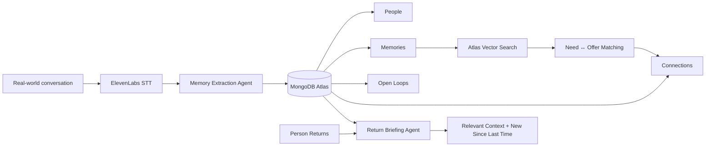

# Thread

**Never lose the thread.** An ambient memory layer for real-world relationships.

Thread listens to conversations, remembers only useful context about the people you meet, tracks promises and open loops, and connects information across different people — so when someone reappears, it knows what's relevant *now*, not merely what was said last time.

Built for the **MongoDB Persistent Context Sprint Hackathon**.

---

## The problem

You meet dozens of people at events. Each conversation leaves behind needs, offers, and promises — and almost all of it evaporates. Worse: the *connections between* people ("the person I met an hour ago is exactly who this person needs") are invisible to everyone, because no single human holds both conversations in memory.

## What makes this persistent context, not prompt-stuffing

The hackathon bar is that persistent context must **change what the system does next**. Thread's core loop:

> conversation A → persistent memory → conversation B → **cross-person insight** → person A returns → **new action surfaced because of everything that happened in between**

Concretely, in the demo:

1. **Meet Maya.** She's building a robotics startup and struggling with vector search. You promise to send her a paper. Thread stores a `need` memory, a `fact`, and an open loop — nothing else.
2. **Meet Daniel.** He works with MongoDB Atlas Vector Search. The moment his `offer` memory lands, Thread searches *other people's* stored needs and surfaces: **Maya ↔ Daniel** — "Daniel works on exactly the vector-search problem Maya mentioned." This insight exists in neither conversation. It exists only in the persistent store.
3. **Maya returns.** Thread computes a return briefing: who she is, what she needed, the paper you still owe her — and **"new since you last spoke": you met Daniel**. That section is computed from connections created *after the timestamp of Maya's previous encounter*. It cannot be faked by storing things on her profile.

> **MongoDB is not being used as transcript storage. It is the persistent social world model that allows information from one interaction to alter future interactions with the same or different people.**

## Architecture



Single Next.js 16 (App Router) application. Server logic lives in `lib/` as plain testable functions; API routes are thin wrappers; React never touches the database.

| Piece | Where | What it does |
| --- | --- | --- |
| Mongo client + vector index | [lib/mongodb.ts](lib/mongodb.ts) | Connection, collections, best-effort `createSearchIndex` for `memories.embedding` |
| Memory extraction | [lib/memoryExtraction.ts](lib/memoryExtraction.ts) | OpenRouter LLM → Zod-validated JSON, retry-with-repair, deterministic fallback parser |
| Need ↔ offer matching | [lib/connectionMatcher.ts](lib/connectionMatcher.ts) | `findRelevantConnections()` — Atlas `$vectorSearch` → LLM judge → keyword overlap |
| Encounter pipeline | [lib/processEncounter.ts](lib/processEncounter.ts) | transcript → memories → open loops → matching → persisted connections |
| Return briefing | [lib/briefing.ts](lib/briefing.ts) | `getReturnBriefing()` + pure `composeBriefing()` with the temporal "new since" logic |
| ElevenLabs | [lib/elevenlabs.ts](lib/elevenlabs.ts) | Scribe speech-to-text + TTS whisper briefing |

## MongoDB usage

Five collections, every document scoped by `sessionId` (so demo reset is surgical):

- **people** — `name`, `shortDescription`, `interests`, `firstMetAt`, `lastEncounterAt`
- **encounters** — `personId`, `startedAt/endedAt`, `transcript` (evidence), `summary`
- **memories** — atomic, independently retrievable: `type` (`fact` | `interest` | `need` | `offer` | `commitment_user_to_person` | `commitment_person_to_user`), `text`, `sourceText` (provenance quote), `importance`, optional `embedding` vector
- **openLoops** — `description`, `owner` (`user`/`person`), `status`, for promises
- **connections** — `personAId` (need side), `personBId` (offer side), `reason`, `score`, `engine`, `triggerMemoryIds`, `createdAt` — **`createdAt` is what powers "new since you last spoke"**

### Semantic matching

When a `need` memory arrives, Thread searches existing `offer` memories belonging to **other** people (and vice versa), through a tiered engine reported honestly in the UI and on every stored connection:

1. **`vector`** — MongoDB **Atlas Vector Search** (`$vectorSearch` on `memories.embedding`, cosine, 1536 dims). Embeddings come from any OpenAI-compatible endpoint (`EMBEDDINGS_*` env vars); the index is created programmatically via `createSearchIndex` on first use.
2. **`llm`** — if vector search is unavailable, an OpenRouter model judges candidate pairs semantically.
3. **`keyword`** — deterministic token-overlap fallback so the demo never dies offline.

The status endpoint (`/api/status`) and the Demo panel show which engine is live.

## ElevenLabs usage

- **Speech-to-text (primary)** — end an encounter and the recorded audio goes to ElevenLabs Scribe; the transcript lands in an editable review sheet before becoming memory.
- **Whisper briefing (secondary)** — a small mic button on the return briefing speaks a concise summary ("Maya — robotics founder. You still owe them the paper. Since you last spoke, you met Daniel…").
- Missing key? Everything degrades to a manual paste/edit transcript sheet. The demo never blocks on audio.

## OpenRouter usage

Structured memory extraction and match judging. Model is configurable via `OPENROUTER_MODEL` — nothing is hardwired to one provider. All LLM output is Zod-validated; one repair retry, then the deterministic parser takes over. The extraction prompt is aggressively selective: keep what someone works on, needs, offers, and promises; ignore greetings, filler, and sensitive details. **Memory should feel selective, not like surveillance.**

## Local setup

```bash
npm install
cp .env.example .env.local   # fill in what you have
npm run dev                  # http://localhost:3000
```

Checks:

```bash
npm run typecheck
npm test                     # 4 demo-flow unit tests, no DB needed
npm run build
```

### Environment variables

| Var | Required | Notes |
| --- | --- | --- |
| `MONGODB_URI` | **yes** | Atlas connection string (a local `mongod` also works — matching falls back below vector) |
| `MONGODB_DB` | no | default `thread` |
| `ELEVENLABS_API_KEY` | no | STT + TTS; manual transcript fallback without it |
| `OPENROUTER_API_KEY` / `OPENROUTER_MODEL` | no | LLM extraction; deterministic parser without it |
| `EMBEDDINGS_API_KEY` (+ `EMBEDDINGS_BASE_URL`, `EMBEDDINGS_MODEL`) | no | enables Atlas Vector Search matching |
| `NEXT_PUBLIC_DEMO_MODE` | no | `true` shows the Demo panel |

### One-time Atlas setup

None beyond a cluster + connection string. The vector search index (`memory_vectors` on `memories.embedding`) is **created programmatically** on first status check/reset when an embeddings key is present. If your cluster tier forbids programmatic search-index creation, create it once in the Atlas UI: JSON editor → collection `memories` → type `vectorSearch` → fields: vector `embedding` (1536, cosine) + filters `type`, `sessionId`, `personId`.

## Running the demo (60–90s)

1. Open the app → **Demo** (top-right) → **Reset demo**.
2. **Meet Maya** (Demo panel scene 1, or dock → Choose person → "Meet someone") → Start encounter → talk, or End encounter → **Load demo conversation** → **Turn into memory**. → *"Maya remembered — 3 useful memories · 1 open loop."*
3. **Meet Daniel** (scene 2) → same flow. → The connection reveal: **A connection you would've missed — Maya ↔ Daniel**.
4. **Maya returns** (scene 3, or select Maya from the dock). → Return briefing: last time, the paper you owe her, **new since you last spoke: Daniel**, best next move: *Introduce Maya to Daniel*. Optional: tap the mic icon for the spoken whisper briefing.

The pre-filled transcripts are a venue-noise fallback — they run through the **exact same** extraction → memory → matching pipeline as live audio. The Maya ↔ Daniel connection is never hardcoded.

## What's implemented vs. fallback

**Implemented:** full persistent memory loop (people/encounters/memories/openLoops/connections in MongoDB), LLM extraction with schema validation, tiered semantic matching including Atlas `$vectorSearch`, temporal return briefing, mic recording + ElevenLabs STT, TTS whisper briefing, demo mode with session-scoped reset, per-person "Forget", polished ambient UI.

**Graceful fallbacks (clearly labeled in-app):** no ElevenLabs key → manual transcript sheet; no OpenRouter key → deterministic demo parser (toast shows "offline parser"); no embeddings key or non-Atlas Mongo → LLM/keyword matching (Demo panel shows "Matching: keyword fallback"). Identity is explicit selection labeled **"Prototype identity"** — we do not pretend it's face recognition.

## Privacy stance

Thread remembers **useful context, not raw life**. Memories are structured and selective, each keeps its `sourceText` quote as provenance, transcripts are stored only as encounter evidence, and any person can be forgotten with one tap (deletes their memories, encounters, loops, and connections).

## The hardware path

This prototype uses a laptop webcam + explicit identity selection as a stand-in for ambient hardware. The architecture is deliberately device-agnostic: the phone in your pocket, earbuds, or camera glasses feed the same `transcribe → extract → remember → match → brief` pipeline. The MongoDB world model is the product; the microphone is just an input.
